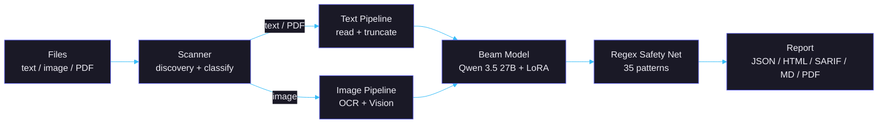

<p align="center">
  
</p>

<h1 align="center">TorchSight</h1>

<p align="center">
  On-premise security scanner and document classifier powered by local LLMs.<br>
  Scans text, images, and PDFs for sensitive data, credentials, and threats. Nothing leaves your machine.
</p>

---

## What it does

TorchSight classifies files into 7 security categories across 51 subcategories using a fine-tuned LLM running locally through [Ollama](https://ollama.com). It detects PII, leaked credentials, financial records, medical data, classified documents, and malicious payloads -- in text files, images, and PDFs. A 35-pattern regex safety net catches anything the model misses.

All inference runs on your hardware. No API calls, no cloud, no telemetry.

---

## Install

```bash
git clone https://github.com/IvanDobrovolsky/torchsight.git
cd torchsight && ./install.sh
```

The installer handles Rust, Ollama, Tesseract, and the Beam model. On Apple Silicon (M1/M2/M3), expect ~2-5 seconds per file.

<details>
<summary>macOS (manual)</summary>

```bash
brew install ollama tesseract rust
ollama pull torchsight/beam
cargo build --release && cp target/release/torchsight /usr/local/bin/
```
</details>

<details>
<summary>Windows</summary>

Use [WSL2](https://learn.microsoft.com/en-us/windows/wsl/install) and follow the Linux instructions.
</details>

<details>
<summary>Manual install</summary>

1. Install [Rust](https://rustup.rs), [Ollama](https://ollama.com), and [Tesseract](https://github.com/tesseract-ocr/tesseract)
2. Pull the model: `ollama pull torchsight/beam`
3. Build: `cargo build --release`
</details>

---

## Usage

```bash
# Scan a directory
torchsight /path/to/scan

# Scan with interactive Q&A after results
torchsight -i /path/to/scan

# Start the REPL
torchsight

# Output formats: json, html, markdown, sarif, pdf
torchsight /path --format sarif

# CI mode -- exit code 1 if findings at or above severity
torchsight /path --fail-on high --format json

# Scan piped content
cat suspicious.txt | torchsight --stdin

# Scan git changes since a ref
torchsight --diff HEAD~3

# Git pre-commit hook
torchsight git-hook install
torchsight git-hook uninstall

# Watch a directory for changes
torchsight watch /path --interval 5s

# Custom policy file
torchsight /path --policy .torchsight/policy.yml
```

---

## Desktop app

A native desktop application built with [Tauri v2](https://v2.tauri.app). Rust backend with a webview frontend, bridging to the same scanning engine as the CLI.

<!-- TODO: Add screenshot here -->

---

## What it detects

| Category | Subcategory examples | Severity range |
|----------|---------------------|----------------|
| **PII** | identity, contact, government_id, biometric, metadata, behavioral | medium -- critical |
| **Credentials** | password, api_key, token, private_key, connection_string, cloud_config, cicd, container | high -- critical |
| **Financial** | credit_card, bank_account, tax, transaction | medium -- critical |
| **Medical** | diagnosis, prescription, lab_result, insurance | medium -- critical |
| **Confidential** | classified, internal, legal, military, military_comms, weapons_systems, intelligence, geospatial, nuclear, education | medium -- critical |
| **Malicious** | injection, exploit, shell, obfuscated, phishing, malware, prompt_injection, supply_chain, deserialization, ssrf, redos, steganography, prototype_pollution, xxe, ssti | high -- critical |
| **Safe** | documentation, code, config, media | info |

Five severity levels: **critical**, **high**, **medium**, **low**, **info**.

See [beam/LABELS.md](beam/LABELS.md) for the full taxonomy.

---

## How it works



Text files (and PDFs via `pdftotext`) are truncated to 6000 characters and sent to the Beam model. Images go through Tesseract OCR and llama3.2-vision for a visual description, then both outputs are combined and sent to Beam for deep analysis. A regex safety net runs on the raw content to catch patterns the LLM may miss.

All model inference runs locally via [Ollama](https://ollama.com) using `/api/generate` with `temperature=0`.

---

## Beam model

[torchsight/beam](beam/) is a custom fine-tune of **Qwen 3.5 27B** (dense) with LoRA (r=128, alpha=256), trained for 5 epochs on ~175K balanced samples from 18+ verified sources (public domain, Apache 2.0, MIT, CC-BY 4.0). Outputs structured JSON arrays of findings with category, subcategory, severity, and explanation.

Two GGUF quantizations are available:

| Variant | Size | Minimum RAM | Use case |
|---------|------|-------------|----------|
| q4_K_M (default) | ~17 GB | 32 GB | Apple Silicon Macs, consumer GPUs |
| q8_0 | ~28 GB | 48 GB+ | Higher quality, data center GPUs |

See [beam/README.md](beam/README.md) and [beam/MODEL_CARD.md](beam/MODEL_CARD.md) for training details, dataset sources, and evaluation.

---

## Project structure

```
torchsight/
  core/           Rust CLI scanner (main binary)
  beam/           Model training pipeline, datasets, GGUFs
  desktop/        Tauri v2 desktop application
  site/           Project website (Astro)
  report/         PDF report generator (Python)
  docs/           Architecture and corpus documentation
  assets/         Logo and static assets
  install.sh      Cross-platform installer
```

---

## License

[Apache 2.0](LICENSE)

## Contributing

See [docs/](docs/) for architecture details. Issues and pull requests welcome.
