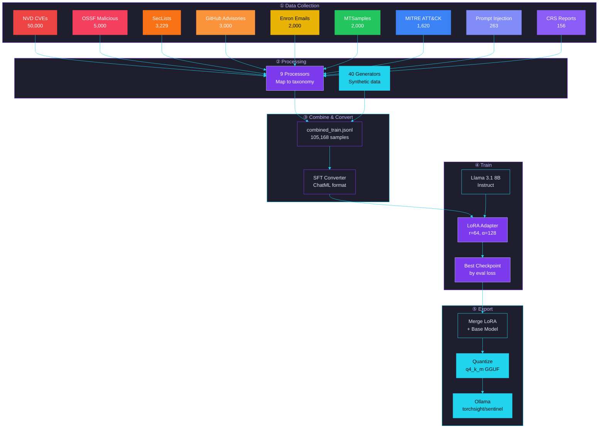
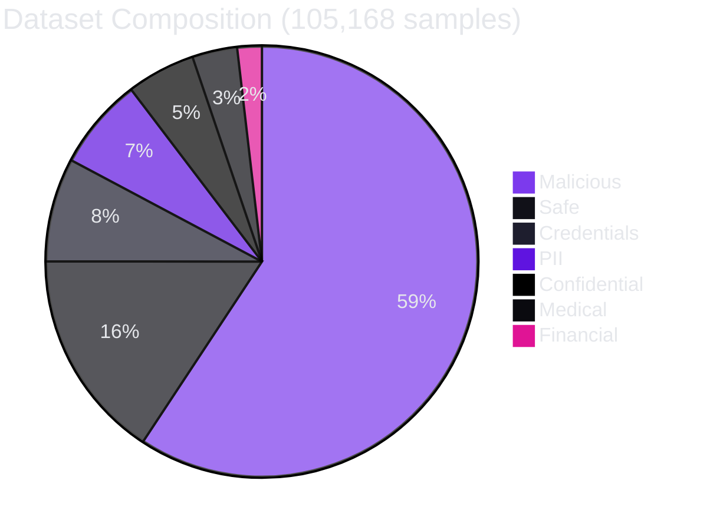
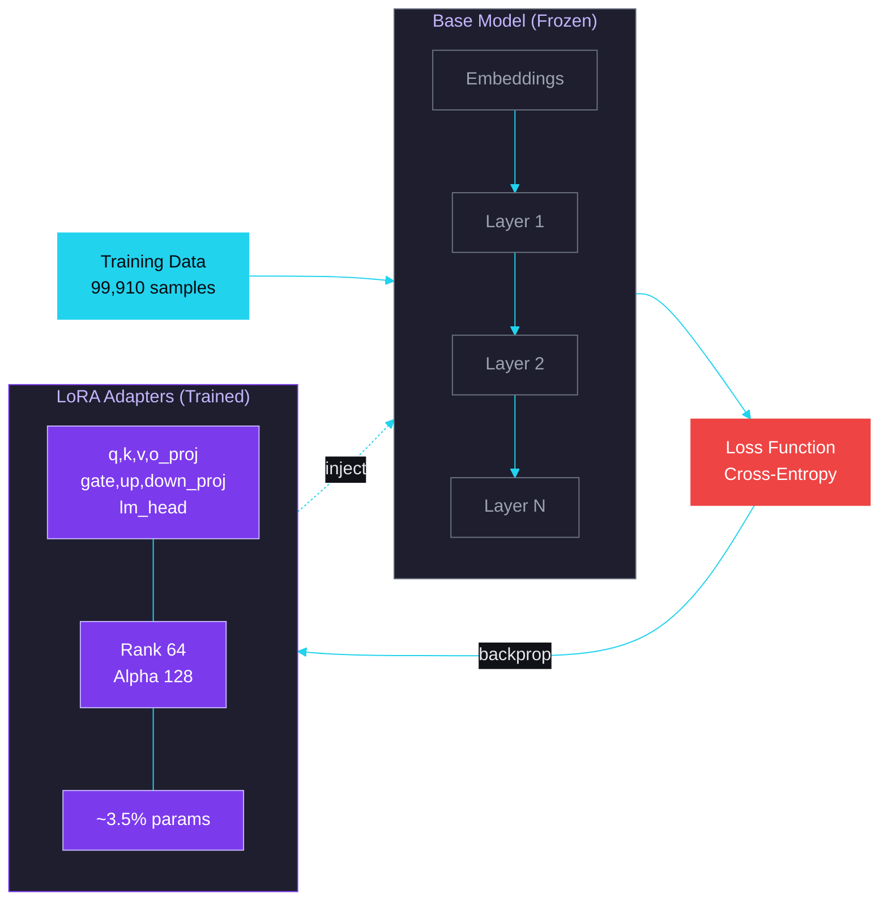
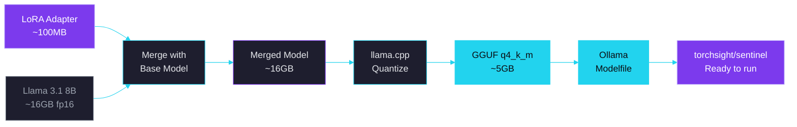
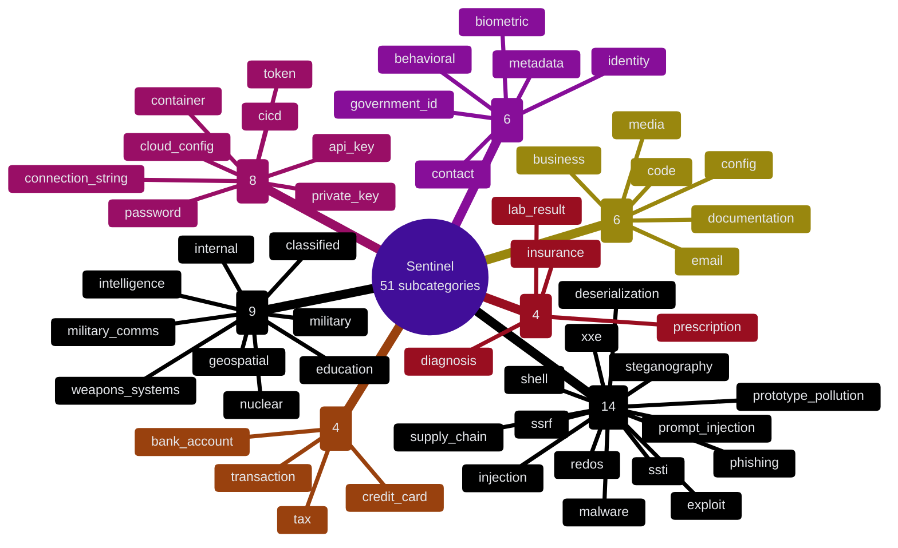

# TorchSight Sentinel

> On-premise cybersecurity document classifier — trained to detect threats, sensitive data, and policy violations in text and images.

## Model Overview

| | |
|---|---|
| **Name** | `torchsight/sentinel` |
| **Base model** | Llama 3.1 8B Instruct |
| **Method** | LoRA fine-tuning (rank 64, alpha 128) |
| **Training data** | 105,168 samples across 51 subcategories |
| **Output format** | GGUF (q4_k_m) for Ollama (~5GB) |
| **License** | Apache 2.0 |

---

## How It Works

The model classifies text into 7 top-level categories with 51 subcategories. Given any document, it outputs a JSON array of findings with category, severity, and explanation.


---

## Training Pipeline



---

## Step-by-Step Explanation

### ① Data Collection

Nine real-world sources, all with verified licenses permitting AI training:

| Source | Samples | License | What it provides |
|---|---|---|---|
| NVD (CVEs 1988-2026) | 50,000 | Public Domain | Vulnerability descriptions mapped to exploit types |
| OSSF Malicious Packages | 5,000 | Apache-2.0 | npm/pypi supply chain attacks, credential theft |
| SecLists Payloads | 3,229 | MIT | XSS, SQLi, command injection, XXE payloads in context |
| GitHub Advisories | 3,000 | CC-BY-4.0 | Security advisories with CWE-to-taxonomy mapping |
| Enron Emails | 2,000 | Public Domain | Real emails with PII, credentials, financial data |
| MTSamples | 2,000 | CC0 | Medical transcriptions with diagnoses and prescriptions |
| MITRE ATT&CK | 1,620 | Apache-2.0 | Attack techniques and malware profiles |
| deepset Prompt Injection | 263 | Apache-2.0 | Prompt injection attacks in realistic contexts |
| CRS Reports | 156 | Public Domain | Military, intelligence, nuclear content |

### ② Processing

Each source has a dedicated processor that:
- Extracts relevant text content
- Maps it to the **51-subcategory taxonomy** using source-specific heuristics (CWE mapping for CVEs, keyword detection for emails, etc.)
- Assigns severity levels and compliance flags
- Outputs standardized JSONL

**40 synthetic generators** fill gaps where real data is sparse or unavailable — producing realistic examples for categories like biometric PII, cloud credentials, weapons systems specs, and safe business documents.



### ③ Combine & Convert

All processed JSONL files are merged into a single `combined_train.jsonl`, then converted to **ChatML format** for instruction tuning:

```json
{
  "messages": [
    {
      "role": "system",
      "content": "You are TorchSight, a cybersecurity document classifier..."
    },
    {
      "role": "user",
      "content": "Analyze this document for security findings.\n\n<document text>"
    },
    {
      "role": "assistant",
      "content": "[{\"category\": \"malicious\", \"subcategory\": \"malicious.injection\", ...}]"
    }
  ]
}
```

The converter:
- Randomizes instruction phrasing (7 templates) to prevent overfitting to specific prompts
- Splits 95/5 train/validation
- Truncates text to 4096 tokens

### ④ Train (LoRA Fine-Tuning)



**LoRA** (Low-Rank Adaptation) injects small trainable matrices into each attention layer of the frozen base model. Only these adapters are trained — the base model weights never change.

| Parameter | Value | Why |
|---|---|---|
| Rank (r) | 64 | High rank = more expressive adaptation |
| Alpha (α) | 128 | Scaling factor (2×r rule for stability) |
| Target layers | All attention + lm_head | Maximum adaptation including output head |
| Trainable params | ~3.5% of model | Small adapter, full model knowledge retained |
| Batch size | 16 × 2 grad accum = 32 effective | Large batches for smooth gradients |
| Epochs | 3 | Full convergence on 100K samples |
| Learning rate | 1e-4 with cosine decay | Conservative for full-precision training |
| Precision | bf16 (no quantization) | Maximum quality — no information loss |
| Optimizer | AdamW fused | Kernel-fused for H100/GH200 |
| Checkpoint | Best model by eval loss | Prevents overfitting, saves optimal weights |

### ⑤ Export



Three-step export process:

1. **Merge** — LoRA adapter weights are mathematically merged back into the base model, producing a single standalone model
2. **Quantize** — `q4_k_m` reduces model size from ~16GB to ~2GB using 4-bit quantization with k-quant importance-based precision allocation
3. **Modelfile** — Creates an Ollama Modelfile with the system prompt and inference parameters baked in

The final GGUF file runs on any machine with Ollama — CPU-only works fine, GPU just makes it faster.

---

## Taxonomy



---

## Usage

```bash
# Install
ollama pull torchsight/sentinel

# Run
ollama run torchsight/sentinel "Analyze this document for security findings."

# Via TorchSight CLI
torchsight scan ./documents/ --model torchsight/sentinel
```

## Output Format

```json
[
  {
    "category": "credentials",
    "subcategory": "credentials.api_key",
    "severity": "critical",
    "explanation": "AWS access key ID found in configuration file"
  },
  {
    "category": "pii",
    "subcategory": "pii.identity",
    "severity": "high",
    "explanation": "Full name and date of birth present in document header"
  }
]
```
