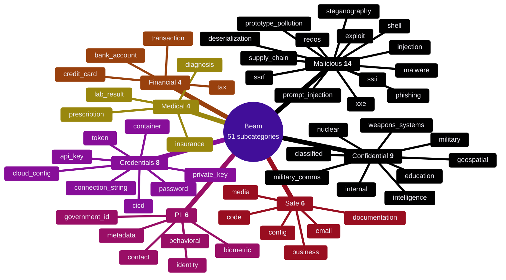

# Beam -- TorchSight's Classification Model

On-premise document classifier trained to detect sensitive data, credentials, security threats, and classified content in text, images, and PDFs.

[Ollama](https://ollama.com/torchsight/beam) | [HuggingFace](https://huggingface.co/torchsight)

## Model Overview

| | |
|---|---|
| **Name** | `torchsight/beam` |
| **Base model** | Qwen 3.5 27B (dense) |
| **Method** | LoRA fine-tuning (r=128, alpha=256) |
| **Epochs** | 5 |
| **Training data** | 78,358 balanced samples (74,441 train / 3,917 val) across 51 subcategories |
| **Training GPU** | H100 80GB PCIe (~55GB VRAM) |
| **Output formats** | GGUF q4\_K\_M (~17GB), q8\_0 (~28GB) |
| **Inference** | temperature=0 (deterministic) |
| **License** | Apache 2.0 |

q4\_K\_M fits 32GB Apple Silicon. q8\_0 requires 48GB+ GPU or 64GB Mac.

---

## Taxonomy

7 categories, 51 subcategories.



---

## Severity Levels

| Level | Criteria | Examples |
|-------|----------|----------|
| `critical` | Immediate exploitable risk. Direct exposure of sensitive data or active threat. | Plaintext SSN, active API key, reverse shell, full credit card, classified documents, nuclear data |
| `high` | Significant risk requiring urgent action. Credentials, military data, internal documents with sensitive content. | Database connection strings, OPORD with coordinates, weapons system specs |
| `medium` | Moderate risk requiring review. Partial exposure or suspicious patterns. | Name + DOB without SSN, internal document without classified content, ReDoS pattern |
| `low` | Minor risk. Minimal exposure, public information with some sensitivity. | Email address alone, file metadata with author name, safe-looking config with commented credentials |
| `info` | No risk. Clean file, safe content. | Documentation, clean source code, stock photos |

### Severity Assignment Rules

- Full SSN, credit card, active credential, exploit code, classified markings with content --> `critical`
- Military operations data, intelligence reports, nuclear information (RD/FRD/CNWDI) --> `critical`
- Prompt injection, supply chain attack, reverse shell, C2 beacon --> `critical`
- Cloud config with IAM keys, CI/CD secrets, container secrets in plaintext --> `critical`
- Name + DOB or name + address (no SSN/ID) --> `medium`
- EXIF GPS coordinates, behavioral tracking data --> `medium`
- Internal/confidential marking without sensitive data --> `medium`
- Email address alone --> `low`
- Safe/clean files --> `info`

---

## Training Data

### Sources (78,358 samples after rebalancing)

| Source | Samples | License | Provides |
|--------|---------|---------|----------|
| NVD (CVEs 1988-2026) | 50,000 | Public Domain (US Gov) | Vulnerability descriptions mapped to exploit taxonomy |
| AI4Privacy | 5,000 | Apache 2.0 | Synthetic PII across 54 PII classes |
| OSSF Malicious Packages | 5,000 | Apache 2.0 | npm/pypi supply chain attacks |
| Fenrir v2.0 | 5,000 | Apache 2.0 | OWASP Top 10 + ATT&CK + NIST CSF coverage |
| SecLists | 3,229 | MIT | XSS, SQLi, command injection, XXE payloads |
| GHSA (GitHub Advisories) | 3,000 | CC-BY 4.0 | Security advisories with CWE mapping |
| SEC EDGAR | 3,000 | Apache 2.0 / Public Domain | Financial filings, corporate disclosures |
| NIST Training | 3,000 | Public Domain (US Gov) | NIST cybersecurity publications |
| Phishing Dataset | 3,000 | Apache 2.0 | Phishing and legitimate email classification |
| Enron Emails | 2,000 | Public Domain (FERC) | Real corporate email with PII, credentials, financial data |
| MITRE ATT&CK | 1,620 | Royalty-free | Attack techniques, malware profiles |
| Loghub | 1,280 | Free for research | System logs from 16 sources |
| deepset Prompt Injection | 263 | Apache 2.0 | Prompt injection attacks in context |
| PayloadsAllTheThings | 170 | MIT | Web attack payloads |
| CRS Reports | 157 | Public Domain (US Gov) | Congressional defense/military/nuclear analysis |
| CIA FOIA | ~100 | Public Domain (US Gov) | Declassified intelligence with classification markings |
| Army Doctrine (ADP/FM) | 4 | Public Domain (US Gov) | OPORD format, tactical terminology, coordinate systems |
| **Synthetic** | **~33,100** | Generated | All categories (see breakdown below) |
| **Hard Negatives** | **~6,400** | Generated | Boundary cases, safe-looking-dangerous and vice versa |

### Synthetic Breakdown

| Domain | Count | Coverage |
|--------|-------|----------|
| Malicious | 9,900 | Prompt injection, supply chain, SSRF, SSTI, XXE, ReDoS, deserialization, steganography, shells, prototype pollution, phishing |
| Credentials | 6,000 | API keys, tokens, private keys, connection strings, cloud config, CI/CD, container secrets |
| Confidential | 5,700 | Classified docs, military ops/comms, weapons systems, intelligence, geospatial, nuclear, education |
| Safe | 5,000 | Documentation, code, config, media, email, business |
| PII | 2,900 | Government IDs, biometric, metadata, behavioral |
| Financial | 2,600 | Credit cards, bank accounts, tax returns |
| Medical | 1,400 | Insurance, lab results |

### Hard Negatives (~6,400 boundary cases)

| Type | Count | Purpose |
|------|-------|---------|
| Safe-looking dangerous | 3,000 | Hidden credentials, subtle prompt injection, obfuscated attacks |
| Dangerous-looking safe | 2,500 | Tutorial credentials, pentest reports, test code, public records |
| Boundary cases | 900 | Multi-category docs, partial redaction, decodable tokens (JWT/base64 with PII) |

---

## Training Pipeline

```mermaid
%%{init: {'theme': 'base', 'themeVariables': {'primaryColor': '#7C3AED','primaryTextColor': '#EEEDF5','primaryBorderColor': '#6366F1','lineColor': '#38BDF8','secondaryColor': '#1A1926','tertiaryColor': '#222136','background': '#0F0E17','mainBkg': '#1A1926','nodeBorder': '#6366F1','clusterBkg': '#222136','titleColor': '#A855F7','edgeLabelBackground': '#1A1926'}}}%%

graph LR
    A["Download<br/>18 sources"] --> B["Process<br/>9 processors"]
    B --> C["Synthetic<br/>40 generators"]
    C --> D["Hard Negatives<br/>boundary cases"]
    D --> E["Rebalance<br/>+ augment"]
    E --> F["SFT Convert<br/>ChatML format"]
    F --> G["LoRA Train<br/>r=128, 5 epochs"]
    G --> H["Export GGUF<br/>q4_K_M + q8_0"]
    H --> I["Ollama<br/>torchsight/beam"]
```



### LoRA Configuration

| Parameter | Value |
|-----------|-------|
| Rank (r) | 128 |
| Alpha | 256 |
| Target layers | All attention (q,k,v,o\_proj) + gate,up,down\_proj + lm\_head |
| Batch size | 4 x 4 grad accum = 16 effective |
| Learning rate | 2e-5 with cosine decay |
| Precision | bf16 |
| Optimizer | AdamW fused |
| Checkpoint selection | Best model by eval loss |
| Compatible stack | trl 0.11.4 + transformers 4.45.2 + peft 0.13.2 |

---

## Quick Start (Retrain)

```bash
cd beam
uv venv && source .venv/bin/activate
uv pip install requests tqdm datasets beautifulsoup4 lxml

# 1. Download all datasets
python scripts/download_all.py

# 2. Process raw data into normalized JSONL
python scripts/processors/process_all.py

# 3. Generate synthetic data
python scripts/processors/synth_generator.py

# 4. Generate hard negatives
python scripts/processors/hard_negatives_generator.py

# 5. Rebalance dataset
python scripts/rebalance_dataset.py

# 6. Convert to ChatML SFT format
python scripts/sft_converter.py

# 7. Train LoRA (requires GPU -- H100 80GB recommended)
python scripts/train_lora.py

# 8. Export to GGUF for Ollama
python scripts/export_gguf.py
```

Requires: trl 0.11.4, transformers 4.45.2, peft 0.13.2. Training takes ~2-4 hours on a single H100.

---

## Output Format

The model outputs a JSON array of findings. Each finding has four fields:

```json
[
  {
    "category": "credentials",
    "subcategory": "credentials.api_key",
    "severity": "critical",
    "explanation": "AWS access key ID (AKIA...) found in environment configuration file"
  },
  {
    "category": "pii",
    "subcategory": "pii.identity",
    "severity": "high",
    "explanation": "Full name and Social Security number present in document header"
  }
]
```

For clean files:

```json
[
  {
    "category": "safe",
    "subcategory": "safe.documentation",
    "severity": "info",
    "explanation": "Standard API documentation with no sensitive content"
  }
]
```

---

## Compliance Tags (L4)

Multi-label compliance tags assigned alongside findings.

| Tag | Full Name | Triggered By |
|-----|-----------|--------------|
| `GDPR` | EU General Data Protection Regulation | Any PII (name, email, address, DOB, biometric) |
| `HIPAA` | Health Insurance Portability & Accountability Act | Any PHI (diagnosis, prescription, lab result, insurance) |
| `PCI-DSS` | Payment Card Industry Data Security Standard | Credit card numbers, CVVs, cardholder data |
| `SOX` | Sarbanes-Oxley Act | Financial records of public companies |
| `FERPA` | Family Educational Rights & Privacy Act | Student records, grades, enrollment data |
| `CCPA` | California Consumer Privacy Act | PII of California residents |
| `ITAR` | International Traffic in Arms Regulations | Military/defense technical data, weapons systems |
| `EAR` | Export Administration Regulations | Dual-use technology, encryption |
| `NIST-800-53` | NIST Security Controls | Government/military information systems |
| `NIST-800-171` | CUI Protection | Controlled Unclassified Information in non-federal systems |
| `EO-13526` | Classified National Security Information | Documents with classification markings (TS/S/C) |
| `DoD-5220.22-M` | National Industrial Security Program | Cleared contractor handling of classified info |
| `10-CFR-1045` | Nuclear Classification (DOE) | Restricted Data (RD), Formerly Restricted Data (FRD) |

---

## License

Apache 2.0. See [LICENSE](../LICENSE).

All training data sources are individually licensed for AI model training. See the training data table above for per-source license details. MITRE ATT&CK requires reproducing the MITRE copyright notice (included in dataset metadata). US Government works are not subject to copyright per 17 U.S.C. Section 105.
