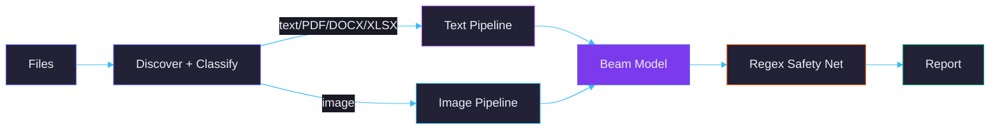

# Architecture

## Pipeline

## Text Pipeline

`core/src/analyzers/text.rs`

1. **Read** — plain text, PDF (`pdftotext`), DOCX/PPTX (`zip` crate), XLSX (`calamine`), DOC (`textutil`/`antiword`). Scanned PDFs fall back to OCR (`pdftoppm` + Tesseract).
2. **Chunk** — content split into 5000-char chunks with 500-char overlap, max 10 chunks. Small files sent as-is.
3. **Classify** — each chunk sent to Beam via Ollama `/api/generate` (temperature=0, num_predict=2048). Response parsed as JSON array of findings.
4. **Deduplicate** — findings merged across chunks by category:subcategory, highest severity wins.
5. **Regex** — 56 compiled patterns run on full content for PII (SSN, email, phone, DOB), financial (credit cards, bank accounts, IBAN, EIN), credentials (AWS keys, Stripe, GitHub tokens, private keys, connection strings), and malicious patterns (SSTI, XXE, deserialization, shells, SSRF, prompt injection). Only fires for categories the model didn't already catch.

## Image Pipeline

`core/src/analyzers/image.rs`

1. **OCR** — Tesseract extracts visible text
2. **Vision** — llama3.2-vision describes the image content via `/api/generate` with base64 image
3. **Deep analysis** — OCR text + vision description combined and sent to Beam

## Ollama Integration

`core/src/llm/ollama.rs`

All inference via `localhost:11434`. The `chat()` method uses `/api/generate` (not `/api/chat`) because Beam's Modelfile template is `{{ .Prompt }}`. System prompt is baked into the prompt string with `### Instruction:` / `### Response:` delimiters.

| Parameter | Value |
|-----------|-------|
| temperature | 0 |
| num_predict | 2048 |
| stop | `["\n\n\n"]` |
| timeout | 600s |

Truncated JSON responses are recovered by `try_repair_json_array()` which handles mid-string truncation from repetitive filler.

## Desktop App

`desktop/` — Tauri v2. Rust backend exposes Tauri commands that call the CLI binary and parse JSON reports. Webview frontend with scan UI, results dashboard, system stats gauges. PDF export via native `window.print()`.

## Detection

7 categories, 51 subcategories. Full taxonomy in [beam/](../beam/).

| Level | When |
|-------|------|
| critical | Immediate risk — exposed SSN, active API key, exploit code, classified data |
| high | Significant risk — credentials, internal docs with PII, military data |
| medium | Moderate risk — partial PII, suspicious patterns, metadata leaks |
| low | Minor risk — email alone, generic internal label |
| info | Clean file |

## Output Formats

JSON (always saved), HTML, Markdown, SARIF 2.1.0, PDF, Terminal.

## Tech Stack

| Component | Technology |
|-----------|-----------|
| CLI | Rust (clap, walkdir, indicatif, reqwest) |
| Desktop | Tauri v2 |
| Text model | Beam — Qwen 3.5 27B + LoRA (r=128, alpha=256) |
| Vision | llama3.2-vision |
| Runtime | Ollama |
| OCR | Tesseract |
| Office | zip crate (DOCX/PPTX), calamine (XLSX) |

## Requirements

| Tier | RAM | Speed |
|------|-----|-------|
| Minimum | 32 GB (CPU) | ~60s/file |
| Recommended | 32 GB Apple Silicon | ~20s/file |
| GPU | 48+ GB VRAM | ~3-5s/file |
