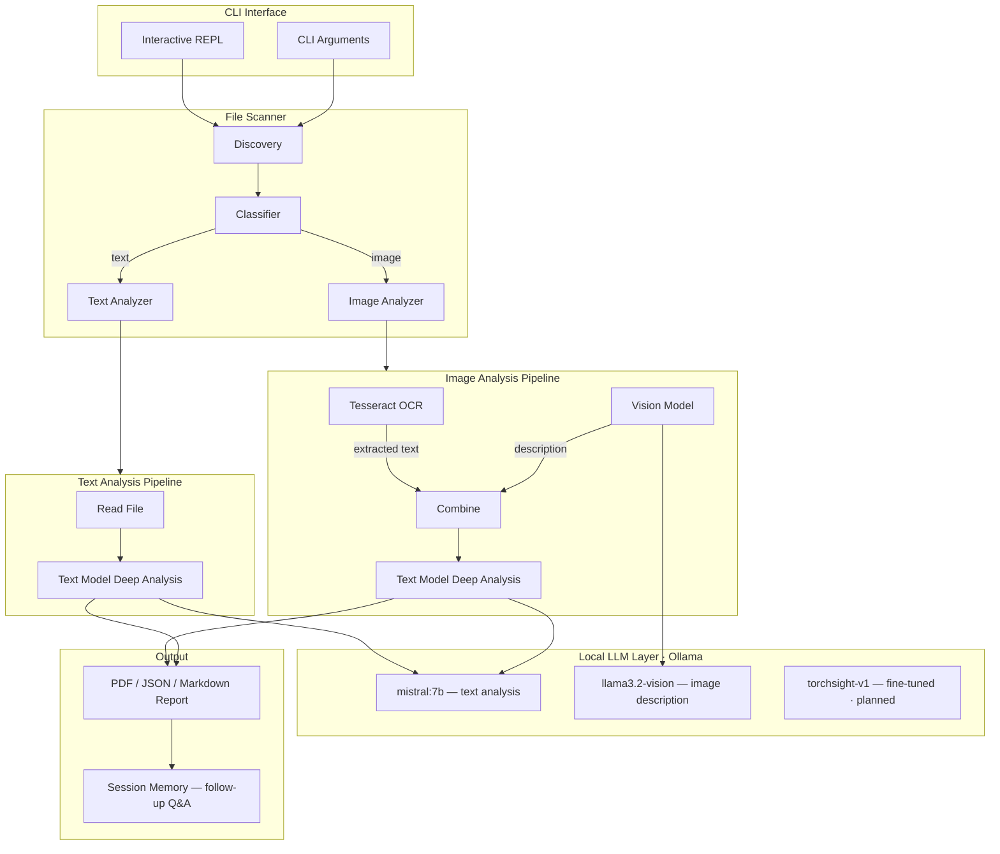
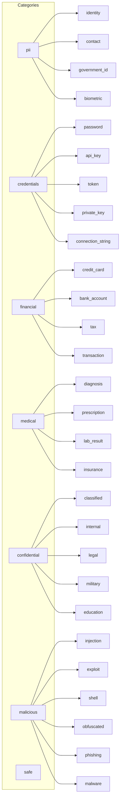

# TorchSight Architecture

## System Overview

## Detection Categories

## Compliance Mapping

| Tag | Regulation | Triggered by |
|-----|-----------|-------------|
| GDPR | EU General Data Protection | Any PII of individuals |
| HIPAA | US Health Insurance Portability | Medical records, PHI |
| PCI-DSS | Payment Card Industry | Credit card numbers, CVVs |
| SOX | Sarbanes-Oxley | Financial records of public companies |
| FERPA | Family Educational Rights | Student records, transcripts |
| CCPA | California Consumer Privacy | PII of California residents |
| ITAR | Int'l Traffic in Arms | Military/defense documents |
| EAR | Export Administration | Dual-use technology |

## Severity Levels

| Level | Meaning | Examples |
|-------|---------|---------|
| `critical` | Immediate exposure risk | Plaintext SSN, active API key, reverse shell |
| `warning` | Moderate risk, needs review | Partial PII, internal doc without markings |
| `info` | Low risk or clean | Safe file classification |

## Tech Stack

| Component | Technology |
|-----------|-----------|
| CLI | Rust, clap, dialoguer, indicatif |
| LLM inference | Ollama (local) |
| Text model | mistral:7b (→ torchsight-v1) |
| Vision model | llama3.2-vision |
| OCR | Tesseract |
| Reports | genpdf (PDF), serde_json |
| Training | Python, HuggingFace transformers, PEFT/LoRA |

## Inference Requirements

| Tier | RAM | GPU | Speed (1000 files) |
|------|-----|-----|---------------------|
| Minimum | 8 GB | CPU only | ~12 hours |
| Recommended | 16 GB | 8+ GB VRAM | ~1 hour |
| Optimal | 32 GB | 12+ GB VRAM | ~25 min |
