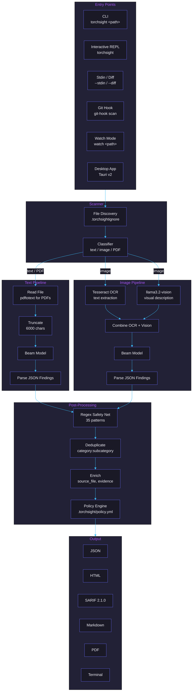
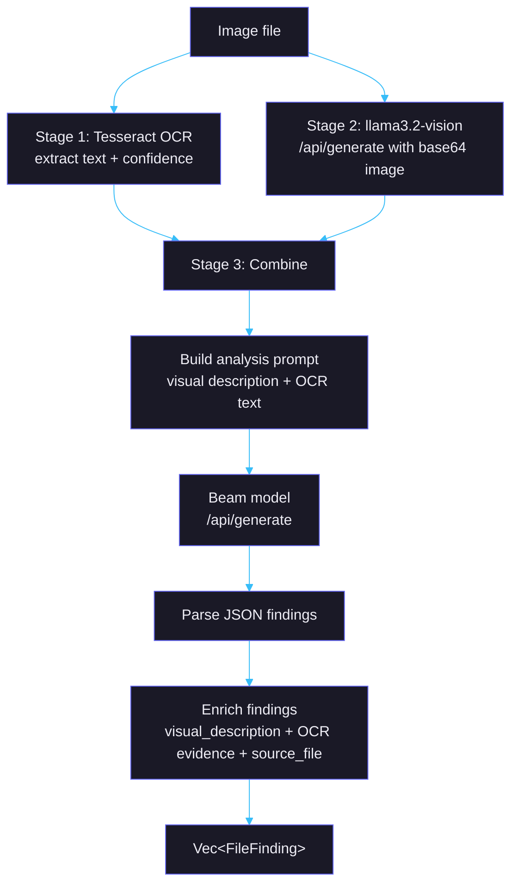
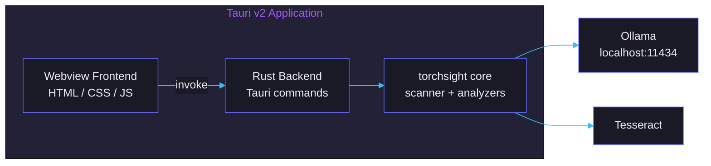
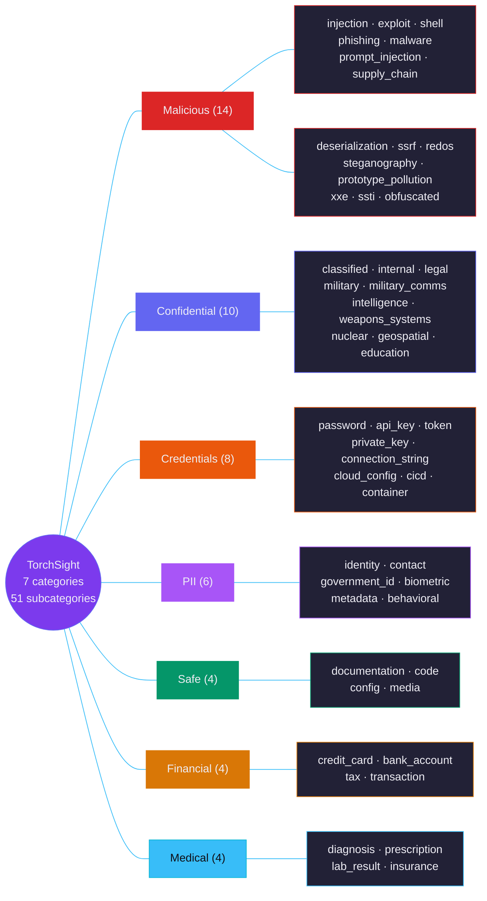

# TorchSight Architecture

## System overview

---

## Scanning pipeline

The scanner processes files in four stages:

### 1. Discovery

`scanner/discovery.rs` walks the target path using `walkdir`. Files are filtered by:

- **Size**: configurable max (default 1024 MB via `--max-size-mb`)
- **Ignore rules**: `.torchsightignore` files (gitignore syntax) exclude paths
- **File type**: binary files without known extensions are skipped

### 2. Classification

`scanner/classifier.rs` determines how to analyze each file:

- **Text**: `.txt`, `.csv`, `.json`, `.xml`, `.yaml`, `.toml`, `.log`, `.md`, `.rs`, `.py`, `.js`, `.ts`, `.go`, `.java`, `.c`, `.cpp`, `.h`, `.sh`, `.sql`, `.html`, `.css`, `.env`, `.conf`, `.cfg`, `.ini`, and similar
- **Image**: `.png`, `.jpg`, `.jpeg`, `.gif`, `.bmp`, `.tiff`, `.webp`
- **PDF**: `.pdf` (text extracted via `pdftotext`)

### 3. Analysis

Each file is routed to the appropriate analyzer. Text and image pipelines are described in detail below.

### 4. Reporting

Results are collected into a `ScanReport` struct and serialized to the requested format. JSON is always saved to disk; additional formats are written based on `--format`.

---

## Text analysis pipeline

**Source**: `core/src/analyzers/text.rs`

```mermaid
%%{init: {'theme': 'base', 'themeVariables': {'primaryColor': '#7C3AED','primaryTextColor': '#EEEDF5','primaryBorderColor': '#6366F1','lineColor': '#38BDF8','secondaryColor': '#1A1926','tertiaryColor': '#222136','background': '#0F0E17','mainBkg': '#1A1926','nodeBorder': '#6366F1','clusterBkg': '#222136','titleColor': '#A855F7','edgeLabelBackground': '#1A1926'}}}%%
graph LR
    FILE["File"] --> IS_PDF{PDF?}
    IS_PDF -->|yes| PDFTOTEXT["pdftotext"]
    IS_PDF -->|no| READ["Read up to 10 MB"]
    PDFTOTEXT --> CONTENT["Raw text"]
    READ --> CONTENT
    CONTENT --> TRUNC["Truncate to 6000 chars"]
    TRUNC --> BEAM["Beam: /api/generate<br>temperature=0, num_predict=2048"]
    BEAM --> PARSE["parse_beam_findings()<br>extract JSON array"]
    PARSE --> REGEX["Regex safety net<br>35 compiled patterns"]
    REGEX --> DEDUP["Deduplicate by<br>category:subcategory"]
    DEDUP --> ENRICH["Add source_file<br>and content preview"]
    ENRICH --> FINDINGS["Vec&lt;FileFinding&gt;"]
```

Key details:

- **Truncation**: Files are read up to 10 MB, then truncated to 6000 characters for the LLM context window. This is a hard limit in `LLM_CONTEXT_LIMIT`.
- **Beam prompt format**: The system prompt and user message are concatenated with `### Instruction:` / `### Response:` markers and sent as a single prompt to `/api/generate`. This matches the Beam model's Modelfile template.
- **JSON parsing**: `parse_beam_findings()` extracts a JSON array from the model response. It handles cases where the model produces text before/after the JSON. Each finding has `category`, `subcategory`, `severity`, and `explanation`.
- **Deduplication**: Findings are deduplicated by `category:subcategory`. When non-safe findings exist, safe entries are dropped.
- **Regex safety net**: 35 compiled regex patterns run against the raw content to catch credentials, API keys, private keys, SSNs, credit card numbers, and other patterns the LLM might miss. Regex findings are added only if the LLM did not already flag that category.

---

## Image analysis pipeline

**Source**: `core/src/analyzers/image.rs`

Three stages run for every image:

1. **OCR** (Tesseract): Extracts visible text and a confidence score. Requires the `tesseract` binary on the system PATH.
2. **Vision** (llama3.2-vision): Describes the image content -- type, subject, any visible text or numbers. Uses `/api/generate` with the image encoded as base64.
3. **Deep analysis** (Beam): The OCR text and vision description are combined into a single prompt and sent to the Beam model. The prompt includes explicit rules to prevent false positives on normal photos.

Finding enrichment adds `visual_description` and OCR text as evidence fields. Safe images include the vision description in the finding.

---

## Beam model integration

**Source**: `core/src/llm/ollama.rs`

All model communication goes through Ollama's HTTP API on `localhost:11434`.

### Endpoints used

| Method | Endpoint | Used for |
|--------|----------|----------|
| `chat()` | `/api/generate` | Beam text/image analysis (system prompt baked into prompt) |
| `describe_image()` | `/api/generate` | Vision model image description (with base64 image) |
| `generate()` | `/api/generate` | Fallback for non-Beam text models |
| `health_check()` | `/api/tags` | Verify Ollama is running |
| `ensure_model()` | `/api/show` + `/api/pull` | Auto-pull missing models |

Note: The `chat()` method uses `/api/generate`, not `/api/chat`. The Beam model's Modelfile uses a raw template (`{{ .Prompt }}`), so the system prompt is concatenated directly into the prompt string with `### Instruction:` / `### Response:` delimiters.

### Request parameters

| Parameter | Value | Reason |
|-----------|-------|--------|
| `temperature` | 0 | Deterministic output for consistent classification |
| `num_predict` | 2048 | Token limit for response; Beam can generate repetitive filler past valid JSON |
| `stop` | `["\n\n\n"]` | Early stop to prevent runaway generation |
| `stream` | false | Wait for complete response |
| `timeout` | 600s | 10-minute timeout per request for slow hardware |

### Truncation recovery

If the model response does not contain valid JSON, the parser attempts to:

1. Find the first `[` and last `]` in the response
2. Parse the substring as a JSON array
3. Return an empty findings list if parsing fails (does not error)

---

## Desktop app architecture

**Source**: `desktop/`

Built with [Tauri v2](https://v2.tauri.app). The desktop app wraps the same Rust scanning engine as the CLI.

- **Frontend**: Webview rendering the scan UI. Communicates with the backend via Tauri's `invoke()` IPC.
- **Backend**: Rust commands exposed to the frontend. These call into the same `core` crate used by the CLI.
- **No separate process**: The scanner runs in-process within the Tauri app, not as a subprocess.

---

## Detection categories

Full taxonomy: [beam/README.md](../beam/README.md)

---

## Severity levels

| Level | Color | Criteria | Examples |
|-------|-------|----------|----------|
| **critical** | #DC2626 | Immediate exploitable risk. Direct exposure of sensitive data or active threat. | Plaintext SSN, active API key with scope, reverse shell, full credit card number, classified document with content |
| **high** | #EA580C | Significant risk requiring prompt action. Clear sensitive data exposure. | Password hash with salt, partial credit card, internal document with PII, exploit PoC |
| **medium** | #D97706 | Moderate risk requiring review. Potential exposure or ambiguous content. | Partial PII (name without SSN), internal document without markings, suspicious encoded payload |
| **low** | #CA8A04 | Minor risk. Limited exposure or low-confidence detection. | Email address in isolation, generic internal label, test credentials |
| **info** | #059669 | No risk. Informational classification only. | Clean file, safe documentation, normal photo |

Severity assignment follows deterministic rules defined in the model's training data. See [beam/LABELS.md](../beam/LABELS.md) for the full rule set.

---

## Report formats

| Format | Flag | Output | Notes |
|--------|------|--------|-------|
| JSON | `--format json` | `.json` file | Always saved to disk regardless of format flag |
| HTML | `--format html` | `.html` file | Self-contained with inline CSS, interactive dashboard |
| Markdown | `--format markdown` | `.md` file | Tables with findings |
| SARIF | `--format sarif` | `.sarif` file | SARIF 2.1.0 for GitHub Code Scanning integration |
| PDF | `--format pdf` | `.pdf` file | Generated via Python (`uv run report/generate.py`), requires `uv` |
| Terminal | default for stdin/diff | stdout | Colored terminal output with severity indicators |

JSON is the canonical format. All other formats are generated from the same `ScanReport` struct. The HTML report uses `report/template.html` with inline data injection.

---

## Tech stack

| Component | Technology | Version / Notes |
|-----------|-----------|-----------------|
| Scanner CLI | Rust | clap, walkdir, indicatif, reqwest, serde |
| Desktop app | Tauri v2 | Rust backend + webview frontend |
| Text model | Qwen 3.5 27B + LoRA | r=128, alpha=256, 5 epochs, 78K samples |
| Vision model | llama3.2-vision | Image description via Ollama |
| LLM runtime | Ollama | Local inference, `/api/generate` endpoint |
| OCR | Tesseract | System binary, not Rust crate |
| PDF extraction | pdftotext | Poppler utility |
| PDF reports | Python + uv | `report/generate.py` |
| Website | Astro | Static site in `site/` |
| Training | Python | trl 0.11.4, transformers 4.45.2, peft 0.13.2 |
| Training GPU | NVIDIA H100 80GB PCIe | ~55 GB VRAM for LoRA training |

---

## Inference requirements

| Tier | RAM | GPU VRAM | Quantization | Speed per file | Notes |
|------|-----|----------|--------------|----------------|-------|
| Minimum | 32 GB | CPU only | q4_K_M | ~6 min | Functional but slow. Not recommended for batch scans. |
| Recommended | 32 GB | Apple Silicon (unified) | q4_K_M | ~2-5 sec | M1 Max / M2 Pro or better. Default configuration. |
| High quality | 48 GB+ | 24+ GB VRAM | q8_0 | ~1-3 sec | NVIDIA RTX 4090, A6000, or similar. Better accuracy. |
| Data center | 64 GB+ | 48+ GB VRAM | q8_0 | <1 sec | H100, A100. Full model in VRAM. |

The q4_K_M quantization (~17 GB) is the default and fits comfortably on a 32 GB Apple Silicon Mac. The q8_0 quantization (~28 GB) provides higher quality but requires more memory.
