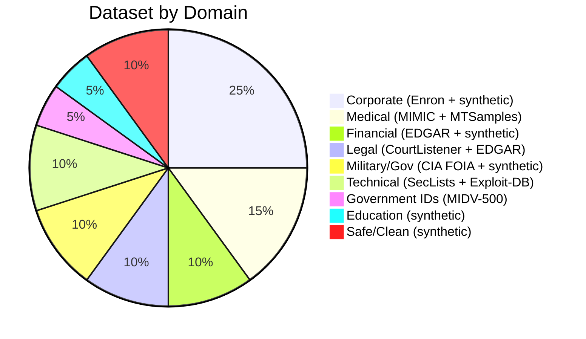
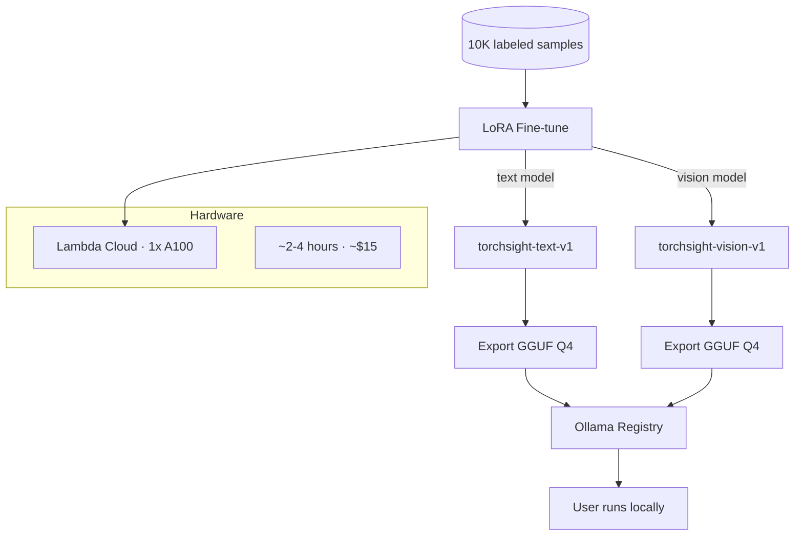

# TorchSight Training Corpus

## Dataset Pipeline

```mermaid
graph LR
    subgraph Public["Public Datasets"]
        ENRON[Enron Emails]
        SECLISTS[SecLists]
        MITRE[MITRE ATT&CK]
        EXPLOITDB[Exploit-DB]
        NVD[NVD/NIST]
        OWASP[OWASP Payloads]
        MIMIC[MIMIC-III]
        MTSAMPLES[MTSamples]
        EDGAR[SEC EDGAR]
        COURT[CourtListener]
        CIA[CIA FOIA]
        MIDV[MIDV-500]
    end

    subgraph Synthetic["Synthetic Generation"]
        SYNTH_MIL[Military docs]
        SYNTH_TAX[Tax returns]
        SYNTH_HR[HR records]
        SYNTH_EDU[Student records]
        SYNTH_CLEAN[Clean files]
    end

    Public --> INGEST[Ingest & Normalize]
    Synthetic --> INGEST
    INGEST --> LABEL[Auto-label with prompt-based TorchSight]
    LABEL --> REVIEW[Human Review & Correction]
    REVIEW --> DATASET[(Labeled Dataset · JSONL)]
    DATASET --> SPLIT{Split}
    SPLIT -->|80%| TRAIN[Train]
    SPLIT -->|10%| VAL[Validation]
    SPLIT -->|10%| TEST[Test / Benchmark]
```



## Sources

### Available & Licensed for Training

| Source | Domain | License | Records | URL |
|--------|--------|---------|---------|-----|
| Enron Email Corpus | Corporate, PII | Public domain (FERC) | ~500K emails | https://www.cs.cmu.edu/~enron/ |
| SecLists | Malicious payloads | MIT | 100K+ payloads | https://github.com/danielmiessler/SecLists |
| MITRE ATT&CK | Threat patterns | Apache 2.0 | 700+ techniques | https://github.com/mitre/cti |
| Exploit-DB | Exploit code | GPL v2 | 45K+ exploits | https://gitlab.com/exploit-database/exploitdb |
| NVD (NIST) | Vulnerabilities | Public domain | 200K+ CVEs | https://nvd.nist.gov/vuln/data-feeds |
| OWASP | Web attack payloads | Apache 2.0 | Various | https://github.com/OWASP/www-project-web-security-testing-guide |
| MIMIC-III | Medical records | PhysioNet (credentialed) | 60K+ admissions | https://physionet.org/content/mimiciii/ |
| MTSamples | Medical transcriptions | Public / free use | 5K+ reports | https://mtsamples.com |
| SEC EDGAR | Financial, Legal | Public domain | Millions | https://www.sec.gov/edgar/searchedgar/companysearch |
| CourtListener | Legal documents | Public domain | 8M+ opinions | https://www.courtlistener.com/api/ |
| CIA FOIA Reading Room | Military, Gov | Public domain | 13M+ pages | https://www.cia.gov/readingroom/ |
| MIDV-500 | Government IDs | CC-BY-NC-SA 4.0 | 500 video clips | https://arxiv.org/abs/1807.05786 |
| CMS Public Use Files | Insurance, Medical | Public domain | Millions | https://data.cms.gov |

### Synthetic (generated)

| Domain | What | Count |
|--------|------|-------|
| Military | Operational orders, personnel rosters, classified memos | 900 |
| Tax/Financial | W-2, 1099, bank statements | 500 |
| HR/Corporate | Employment contracts, performance reviews | 500 |
| Education | Transcripts, enrollment records | 500 |
| Clean/Safe | README files, clean code, config, photos | 1000 |

## Label Taxonomy

### Category (L1) → Subcategory (L2)

```
pii
  ├── pii.identity           name, DOB, SSN, gender, nationality
  ├── pii.contact            phone, email, address
  ├── pii.government_id      driver's license, passport, national ID
  └── pii.biometric          fingerprint, face photo, iris scan

credentials
  ├── credentials.password          plaintext or hashed passwords
  ├── credentials.api_key           AWS, GCP, Stripe, etc.
  ├── credentials.token             OAuth, JWT, session tokens
  ├── credentials.private_key       SSH, PGP, TLS keys
  └── credentials.connection_string database URIs, JDBC

financial
  ├── financial.credit_card    card numbers, CVV, expiry
  ├── financial.bank_account   account/routing numbers
  ├── financial.tax            W-2, 1099, tax returns
  └── financial.transaction    invoices, payments, wire transfers

medical
  ├── medical.diagnosis        conditions, diseases
  ├── medical.prescription     medications, dosages
  ├── medical.lab_result       blood work, imaging
  └── medical.insurance        policy numbers, claims

confidential
  ├── confidential.classified  TOP SECRET / SECRET / CONFIDENTIAL
  ├── confidential.internal    internal-only corporate docs
  ├── confidential.legal       NDAs, contracts, attorney-client
  ├── confidential.military    operations, coordinates, rosters
  └── confidential.education   FERPA-protected student records

malicious
  ├── malicious.injection      SQLi, XSS, command injection
  ├── malicious.exploit        buffer overflow, RCE, PoC
  ├── malicious.shell          reverse shell, web shell, backdoor
  ├── malicious.obfuscated     base64 payloads, encoded shellcode
  ├── malicious.phishing       fake login, credential harvesting
  └── malicious.malware        C2 beacon, keylogger, ransomware

safe
  ├── safe.documentation       README, docs, manuals
  ├── safe.code                clean source code
  ├── safe.config              non-sensitive configuration
  └── safe.media               photos, artwork
```

### Severity (L3)

| Level | When |
|-------|------|
| `critical` | Immediate risk — exposed SSN, active API key, exploit code |
| `warning` | Needs review — partial PII, suspicious pattern |
| `info` | Clean file or minimal exposure |

### Compliance Tags (L4, multi-label)

`GDPR` `HIPAA` `PCI-DSS` `SOX` `FERPA` `CCPA` `ITAR` `EAR`

## Annotation Schema

```json
{
  "id": "enron-00421",
  "source": "enron",
  "domain": "corporate",
  "input": {
    "type": "text | image",
    "filename": "meeting_notes.txt",
    "content": "...",
    "ocr_text": null,
    "vision_description": null
  },
  "findings": [
    {
      "category": "pii",
      "subcategory": "pii.identity",
      "severity": "critical",
      "description": "Email contains SSN and personal identity",
      "extracted_data": {
        "full_name": "John Smith",
        "ssn": "482-39-1843"
      },
      "compliance": ["GDPR", "CCPA"]
    }
  ],
  "metadata": {
    "annotator": "auto-v1 | human",
    "verified": false,
    "difficulty": "easy | medium | hard",
    "split": "train | val | test"
  }
}
```

## Target Composition (~10K samples)



## Training Plan


