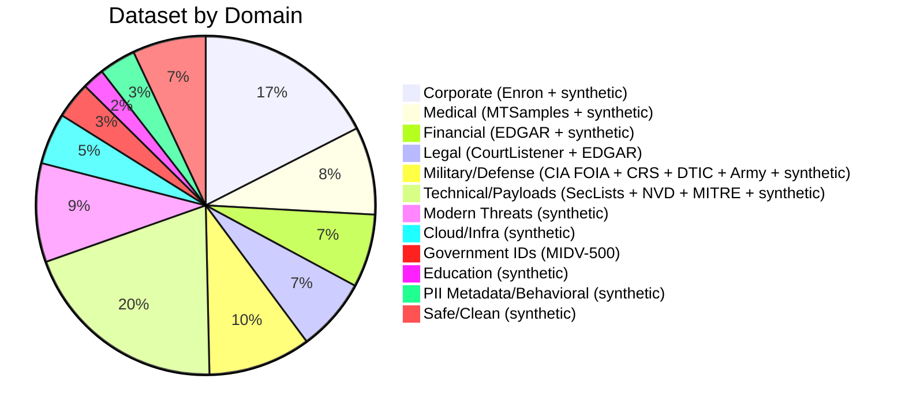

# TorchSight Training Corpus

## Dataset Pipeline

```mermaid
graph LR
    subgraph Public["Public Datasets"]
        ENRON[Enron Emails]
        SECLISTS[SecLists]
        MITRE[MITRE ATT&CK]
        NVD[NVD/NIST]
        OWASP[OWASP WSTG]
        MTSAMPLES[MTSamples]
        EDGAR[SEC EDGAR]
        COURT[CourtListener]
        CIA[CIA FOIA]
        MIDV[MIDV-500]
        CRS[CRS Reports]
        DTIC[DTIC Public]
        ARMY[Army Doctrine]
    end

    subgraph Synthetic["Synthetic Generation"]
        SYNTH_MIL[Military ops / intel]
        SYNTH_TAX[Tax returns]
        SYNTH_HR[HR records]
        SYNTH_EDU[Student records]
        SYNTH_CRED[Cloud / CI-CD / container secrets]
        SYNTH_MODERN[Prompt injection / supply chain / SSRF]
        SYNTH_CLEAN[Clean files]
    end

    Public --> INGEST[Ingest & Normalize]
    Synthetic --> INGEST
    INGEST --> LABEL[Auto-label with prompt-based TorchSight]
    LABEL --> REVIEW[Human Review & Correction]
    REVIEW --> DATASET[(Labeled Dataset · JSONL)]
    DATASET --> SPLIT{Split}
    SPLIT -->|80%| TRAIN[Train]
    SPLIT -->|10%| VAL[Validation]
    SPLIT -->|10%| TEST[Test / Benchmark]
```



## Sources & License Audit

> Every dataset used for training has been verified to permit research and model training.

### Confirmed — Licensed for Training

| Source | Domain | License | Training OK | Records | URL |
|--------|--------|---------|-------------|---------|-----|
| Enron Email Corpus | Corporate, PII | **Public domain** (FERC release) | Yes | ~500K emails | https://www.cs.cmu.edu/~enron/ |
| SecLists | Malicious payloads | **MIT** | Yes | 100K+ payloads | https://github.com/danielmiessler/SecLists |
| MITRE ATT&CK | Threat patterns | **Royalty-free** (research/dev/commercial) | Yes (with copyright notice) | 700+ techniques | https://github.com/mitre/cti |
| NVD (NIST) | Vulnerabilities | **Public domain** (US Gov) | Yes | 200K+ CVEs | https://nvd.nist.gov/vuln/data-feeds |
| OWASP WSTG | Web attack methodology | **CC BY-SA 4.0** | Yes (with attribution) | Various | https://github.com/OWASP/wstg |
| MTSamples | Medical transcriptions | **CC0 / Public use** | Yes | 5K+ reports | https://mtsamples.com |
| SEC EDGAR | Financial, Legal | **Public domain** (US Gov) | Yes | Millions | https://www.sec.gov/edgar/ |
| CourtListener | Legal documents | **Public domain** (court records) | Yes | 8M+ opinions | https://www.courtlistener.com/api/ |
| CIA FOIA Reading Room | Intelligence, Gov | **Public domain** (US Gov) | Yes | 13M+ pages | https://www.cia.gov/readingroom/ |
| CRS Reports | Defense analysis | **Public domain** (US Gov) | Yes | 10K+ reports | https://crsreports.congress.gov/ |
| DTIC Public Reports | Defense technical | **Public domain** (US Gov) | Yes | Millions | https://discover.dtic.mil/ |
| Army Doctrine (ADP/FM) | Military operations | **Public domain** (US Gov) | Yes | Hundreds | https://armypubs.army.mil/ |
| GAO Reports | Government audit | **Public domain** (US Gov) | Yes | 80K+ reports | https://www.gao.gov/ |
| MIDV-500 | Government IDs | **CC / Public domain** (Wikimedia sources) | Yes (with attribution) | 500 video clips | https://arxiv.org/abs/1807.05786 |

### Excluded — License Issues

| Source | Reason for Exclusion |
|--------|---------------------|
| ~~MIMIC-III~~ | PhysioNet DUA **explicitly prohibits** sharing data with LLM services. Local fine-tuning is ambiguous under the agreement. Too risky — replaced with MTSamples + synthetic. |
| ~~Exploit-DB~~ (as training data) | Repository is GPL v2. Individual exploits have no clear license. Whether model training creates a "derivative work" under GPL is legally debated. **We use NVD metadata + synthetic exploit samples instead.** Exploit-DB retained only as a reference for realistic synthetic generation, not as direct training data. |

### Notes on Specific Datasets

- **MTSamples**: The CC0 label comes from Kaggle redistributors, not the original site. However, the dataset has been used in 100+ published NLP papers without issue. We include attribution to mtsamples.com as the original source.
- **MITRE ATT&CK**: License requires reproducing MITRE copyright notice. We include this in our dataset metadata.
- **OWASP**: CC BY-SA 4.0 requires attribution and share-alike for derivatives. Model weights are generally not considered a derivative work of training data, but we include attribution regardless.
- **US Government works**: Per 17 U.S.C. § 105, works of the US Government are not subject to copyright. This covers CIA FOIA, NVD, SEC EDGAR, CourtListener (court opinions), CRS Reports, DTIC, Army doctrine, and GAO reports.

## Military / Defense / Intelligence Sources (all public domain)

These US Government sources provide real documents with classification markings, military terminology, and intelligence formats:

| Source | What It Provides | Coverage |
|--------|-----------------|----------|
| CIA FOIA Reading Room | Declassified intelligence reports with original classification markings | `confidential.classified`, `confidential.intelligence` |
| CRS Reports | Congressional defense analysis — weapons programs, force structure, budget | `confidential.weapons_systems`, `confidential.military` |
| DTIC Public Reports | Defense technical reports, after-action reviews | `confidential.military`, `confidential.military_comms` |
| Army Doctrine (ADP/FM/ATP) | OPORD format, MDMP, tactical terminology, coordinate systems | `confidential.military_comms`, `confidential.geospatial` |
| GAO Defense Reports | Audits of weapons programs, nuclear enterprise, intelligence community | `confidential.weapons_systems`, `confidential.nuclear` |
| DNI Declassified Docs | Declassified NIEs, PDBs, intelligence assessments | `confidential.intelligence`, `confidential.classified` |

### Synthetic (generated)

| Domain | What | Count |
|--------|------|-------|
| Military operations | OPORDs, FRAGOs, SITREPs with DTG, MGRS coordinates, unit designations | 300 |
| Military comms | Tactical communications, SALUTE reports, contact reports | 250 |
| Weapons systems | Technical specification sheets, capability briefs | 200 |
| Intelligence | HUMINT/SIGINT/IMINT reports with source ratings | 300 |
| Geospatial/Targeting | Target packages, coordinate sets, imagery metadata | 200 |
| Nuclear | RD/FRD/CNWDI handling sheets, facility status reports | 150 |
| Cloud/CI-CD/Container | AWS configs, GitHub Actions, Dockerfiles, K8s secrets | 700 |
| Modern threats | Prompt injection, supply chain, SSRF, ReDoS, XXE, SSTI | 1350 |
| Tax/Financial | W-2, 1099, bank statements, invoices | 500 |
| HR/Corporate | Employment contracts, performance reviews | 500 |
| Education | Transcripts, enrollment records | 300 |
| PII metadata | EXIF data, PDF properties, Office metadata | 300 |
| Behavioral tracking | Browsing history, location traces, search queries | 200 |
| Safe/Clean | README files, clean code, config, photos | 1000 |

## Label Taxonomy

### Category (L1) → Subcategory (L2)

```
pii
  ├── pii.identity           name, DOB, SSN, gender, nationality
  ├── pii.contact            phone, email, address
  ├── pii.government_id      driver's license, passport, national ID
  ├── pii.biometric          fingerprint, face photo, iris scan
  ├── pii.metadata           EXIF GPS, PDF author, Office properties
  └── pii.behavioral         browsing history, search queries, location traces

credentials
  ├── credentials.password          plaintext or hashed passwords
  ├── credentials.api_key           AWS, GCP, Stripe, etc.
  ├── credentials.token             OAuth, JWT, session tokens
  ├── credentials.private_key       SSH, PGP, TLS keys
  ├── credentials.connection_string database URIs, JDBC
  ├── credentials.cloud_config      AWS/GCP/Azure configs, terraform state
  ├── credentials.cicd              GitHub Actions, Jenkins, GitLab CI secrets
  └── credentials.container         Dockerfile ENV, K8s secrets, Helm values

financial
  ├── financial.credit_card    card numbers, CVV, expiry
  ├── financial.bank_account   account/routing numbers
  ├── financial.tax            W-2, 1099, tax returns
  └── financial.transaction    invoices, payments, wire transfers

medical
  ├── medical.diagnosis        conditions, diseases
  ├── medical.prescription     medications, dosages
  ├── medical.lab_result       blood work, imaging
  └── medical.insurance        policy numbers, claims

confidential
  ├── confidential.classified      TOP SECRET / SECRET / CONFIDENTIAL
  ├── confidential.internal        internal-only corporate docs
  ├── confidential.legal           NDAs, contracts, attorney-client
  ├── confidential.military        operations, coordinates, force disposition
  ├── confidential.military_comms  OPORDs, FRAGOs, SITREPs, INTREPs
  ├── confidential.weapons_systems weapons specs, export-controlled data
  ├── confidential.intelligence    HUMINT, SIGINT, IMINT, OSINT reports
  ├── confidential.geospatial      MGRS coordinates, targeting data, imagery
  ├── confidential.nuclear         RD, FRD, CNWDI, NNPI
  └── confidential.education       FERPA-protected student records

malicious
  ├── malicious.injection            SQLi, XSS, command injection
  ├── malicious.exploit              buffer overflow, RCE, PoC
  ├── malicious.shell                reverse shell, web shell, backdoor
  ├── malicious.obfuscated           base64 payloads, encoded shellcode
  ├── malicious.phishing             fake login, credential harvesting
  ├── malicious.malware              C2 beacon, keylogger, ransomware
  ├── malicious.prompt_injection     LLM jailbreaks, indirect injection
  ├── malicious.supply_chain         dependency confusion, typosquatting
  ├── malicious.deserialization      pickle, YAML, Java deserialization
  ├── malicious.ssrf                 cloud metadata, internal service probes
  ├── malicious.redos                catastrophic backtracking regexes
  ├── malicious.steganography        hidden data in images/audio
  ├── malicious.prototype_pollution  __proto__ manipulation
  ├── malicious.xxe                  XML External Entity injection
  └── malicious.ssti                 server-side template injection

safe
  ├── safe.documentation       README, docs, manuals
  ├── safe.code                clean source code
  ├── safe.config              non-sensitive configuration
  └── safe.media               photos, artwork
```

### Severity (L3)

| Level | When |
|-------|------|
| `critical` | Immediate risk — exposed SSN, active API key, exploit code, classified data |
| `warning` | Needs review — partial PII, suspicious pattern, file metadata leaks |
| `info` | Clean file or minimal exposure |

### Compliance Tags (L4, multi-label)

`GDPR` `HIPAA` `PCI-DSS` `SOX` `FERPA` `CCPA` `ITAR` `EAR` `EO-13526` `NIST-800-53` `NIST-800-171` `DoD-5220.22-M` `10-CFR-1045`

## Annotation Schema

```json
{
  "id": "enron-00421",
  "source": "enron",
  "source_license": "public_domain",
  "domain": "corporate",
  "input": {
    "type": "text | image",
    "filename": "meeting_notes.txt",
    "content": "...",
    "ocr_text": null,
    "vision_description": null
  },
  "findings": [
    {
      "category": "pii",
      "subcategory": "pii.identity",
      "severity": "critical",
      "description": "Email contains SSN and personal identity",
      "extracted_data": {
        "full_name": "John Smith",
        "ssn": "482-39-1843"
      },
      "compliance": ["GDPR", "CCPA"]
    }
  ],
  "metadata": {
    "annotator": "auto-v1 | human",
    "verified": false,
    "difficulty": "easy | medium | hard",
    "split": "train | val | test"
  }
}
```

## Target Composition (~14K samples)



## Training Plan


